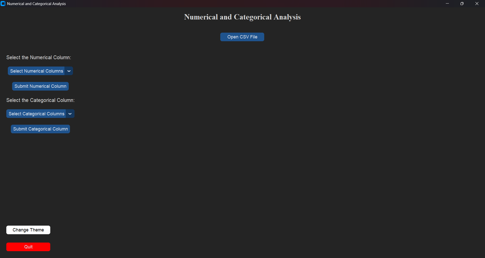

# 📊 Numerical and Categorical Analysis using Python

A sleek Python desktop application that lets you explore and visualize your dataset effortlessly using **CustomTkinter**, **Pandas**, **Matplotlib**, and **Seaborn**.

---

## ✨ Features

- 🌗 **Theme Toggle** — Seamlessly switch between light and dark mode.
- 📂 **CSV File Loader** — Import any `.csv` file and auto-detect column types.
- 🔢 **Numerical Analysis**:
  - Histogram with KDE for distribution insight
  - Boxplot for outlier and spread detection
- 🔤 **Categorical Analysis**:
  - Bar chart for frequency count
  - Pie chart for percentage representation
- 📐 **Responsive UI** — Built with `CustomTkinter` for a modern look and feel.
- 🧭 **Matplotlib Toolbar** — Zoom, pan, and save your plots easily.

---

## 📦 Requirements

Ensure you have **Python 3.x** installed, then run:

```bash
pip install customtkinter pandas matplotlib seaborn
```

---

## ▶️ How to Run

1. Clone or download the repository.
2. Navigate to the project directory.
3. Run the app using:

```bash
python main.py
```

---

## 🖼️ Screenshot

Here’s what the application looks like in action:



---

## 📄 License

Licensed under the [MIT License](LICENSE) — free for personal and commercial use.

---

## 🙌 Acknowledgements

- [CustomTkinter](https://github.com/TomSchimansky/CustomTkinter)
- [Pandas](https://pandas.pydata.org/)
- [Matplotlib](https://matplotlib.org/)
- [Seaborn](https://seaborn.pydata.org/)
